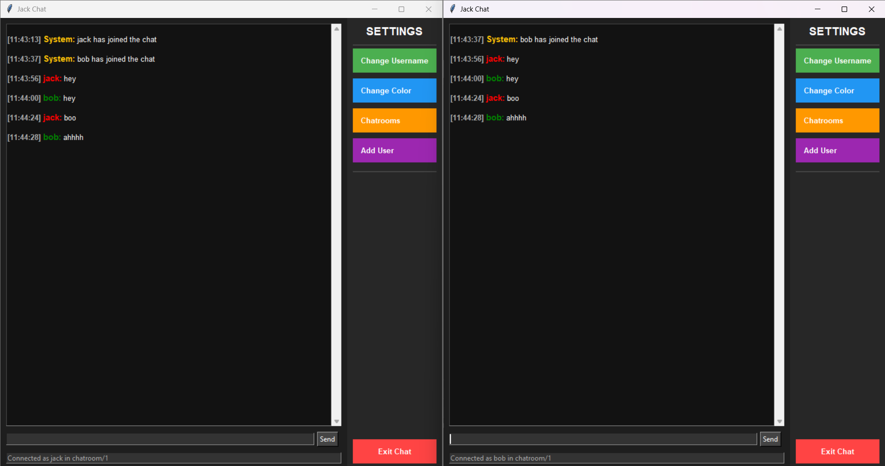

# Jack Chat

Jack Chat is a Python-based chat application that uses MQTT for real-time communication. It features a graphical user interface (GUI) built with Tkinter.

## Features

- Join chatrooms and communicate in real-time.
- Manage chatroom history and invitations.
- Customize your username and color.
- Invite other users to join your chatroom.

## Requirements

Before running or building the application, ensure you have the following installed:

- Python 3.6 or later
- `pip` (Python package manager)
- Required Python libraries:
  - `tkinter` (comes pre-installed with Python)
  - `paho-mqtt`

## Installation

1. Clone this repository or download the source code.
2. Install the required Python libraries by running:

   ```bash
   pip install paho-mqtt
   ```

## Running the Application

To run the application, execute the `1.py` script:

```bash
python 1.py
```

## Building the Application

To build the application into an executable, you can use **PyInstaller**:

1. Install PyInstaller:

   ```bash
   pip install pyinstaller
   ```

2. Use the provided `1.spec` file to build the executable:

   ```bash
   pyinstaller 1.spec
   ```

3. After the build process completes, the executable will be located in the `build/1/` directory.

## Notes

- The application connects to the public MQTT broker `broker.hivemq.com` on port `1883`.
- Chatroom and invitation data are stored locally in JSON files in the user's home directory:
  - `.jack_chat_rooms.json`
  - `.jack_chat_invitations.json`

## Example

Below is a screenshot showing two users ("jack" and "bob") chatting in the same chatroom using Jack Chat:

